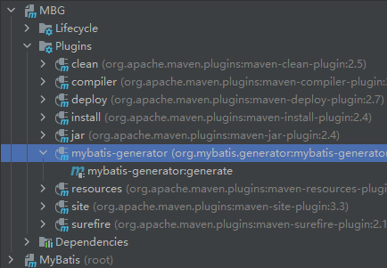

# Mybatis学习笔记（已完结）

## 声明

本笔记源于尚硅谷的教程再加上自己的总结，如果有不明白的地方需要参考原教程[MyBatis教程](https://www.bilibili.com/video/BV1VP4y1c7j7?p=25&spm_id_from=pageDriver)

这篇笔记的逻辑比较乱，适合学习过后遗忘了某部分知识点的时候拿来复习，初学者最好不要看。

### 特性

1.是一个半自动的ORM框架

2.支持定制化SQL、存储过程以及高级映射

### 和其他技术的对比

#### JDBC
1. SQL语句夹杂，当需求更改时，代码更改困难
2. 代码冗长，开发效率低

####Hibernate和JPA
1. 操作简便，开发效率高
2. 程序中的长难SQL需要绕过框架
3. 内部自动产生的SQL，不容易做特殊优化
4. 基于全映射，大量字段的POJO进行部分映射比较困难

####MyBatis
1. 轻量级，性能好
2. SQL 和 Java语句分开
3. 效率略低于Hibernate，但能够接受

### Maven配置
将以下代码加入pom.xml文件中
```
<dependencies>
        <!-- mybatis -->
        <dependency>
            <groupId>org.mybatis</groupId>
            <artifactId>mybatis</artifactId>
            <version>3.5.7</version>
        </dependency>
        <!-- junit -->
        <dependency>
            <groupId>junit</groupId>
            <artifactId>junit</artifactId>
            <version>4.13.2</version>
            <scope>test</scope>
        </dependency>
        <!-- mysql连接 -->
        <dependency>
            <groupId>mysql</groupId>
            <artifactId>mysql-connector-java</artifactId>
            <version>8.0.20</version>
        </dependency>
        <dependency>
            <groupId>junit</groupId>
            <artifactId>junit</artifactId>
            <version>4.12</version>
            <scope>test</scope>
        </dependency>
    </dependencies>
```

### 配置映射文件

在src/main/resources的路径下创建名为mybatis-config.xml的配置文件，并添加以下代码

<span id="jump3">**注意：
核心配置文件中的标签必须按照固定的顺序：
properties?,settings?,typeAliases?,typeHandlers?,objectFactory?,objectWrapperFactory?,reflectorF
actory?,plugins?,environments?,databaseIdProvider?,mappers?**</sapn>

```
<?xml version="1.0" encoding="UTF-8" ?> <!DOCTYPE configuration PUBLIC "-//mybatis.org//DTD Config 3.0//EN"
        "http://mybatis.org/dtd/mybatis-3-config.dtd">
<configuration>
    <!--设置连接数据库的环境-->
    <environments default="development">
        <environment id="development">
            <!--事务管理类型-->
            <transactionManager type="JDBC"/>
            <!--使用连接池-->
            <dataSource type="POOLED">
                <property name="driver" value="com.mysql.cj.jdbc.Driver"/>
                <!--这里会出毛病-->
                <!--<property name="url" value="jdbc:mysql://localhost:3306/MyBatis"/>-->
                <property name="url" value="jdbc:mysql://localhost:3306/mybatis?useUnicode=true&amp;useJDBCCompliantTimezoneShift=true&amp;useLegacyDatetimeCode=false&amp;serverTimezone=UTC"/>
                <property name="username" value="root"/>
                <property name="password" value="123456"/>
            </dataSource>
        </environment>
    </environments>
    <!--引入映射文件-->
    <mappers>
        <mapper resource="mappers/UserMapper.xml"/>
    </mappers>
</configuration>
```
注意，deriver的值在高版本的connecter下为com.mysql.cj.jdbc.Driver而非com.mysql.jdbc.Driver

### mapper接口
MyBatis中的mapper接口相当于以前的dao。但是区别在于，mapper仅仅是接口，我们不需要
提供实现类。

创建数据表


创建实体类


创建mapper接口


### 创建映射文件
要点1：映射文件中mapper的命名空间与全类名一致

要点2：映射文件中SQL语句的id和mapper接口的方法名一致


### 测试功能

新建测试方法
代码如下
```
@Test
    public void test(){
        try {
            //加载核心配置文件
            InputStream is = Resources.getResourceAsStream("mybatis-config.xml");
            //获取sqlSessionFactoryBuilder
            SqlSessionFactoryBuilder sqlSessionFactoryBuilder = new SqlSessionFactoryBuilder();
            //使用配置文件创建的流来获取sqlSessionFactory
            SqlSessionFactory sqlSessionFactory = sqlSessionFactoryBuilder.build(is);
            //获取sqlSession(自动提交事务)
            //如果不写true是手动提交事务
            SqlSession sqlSession=sqlSessionFactory.openSession(true);
            //获取Mapper接口的实现类
            UserMapper userMapper = sqlSession.getMapper(UserMapper.class);
            //测试功能
            userMapper.insertUser();
        } catch (IOException e) {
            e.printStackTrace();
        }
    }
```

我途中遇到的问题：

1. mybatis的配置文件中，写成这样会有时区的问题（8.0版本以上的connector会有这个问题）

``<property name="url" value="jdbc:mysql://localhost:3306/MyBatis"/>``

改成这个就行

```<property name="url" value="jdbc:mysql://localhost:3306/mybatis?useUnicode=true&amp;useJDBCCompliantTimezoneShift=true&amp;useLegacyDatetimeCode=false&amp;serverTimezone=UTC"/>```

2. mybatis的配置文件记得更新映射文件

**重点**

获取Mapper接口的实现类，将Mapper接口转为实现类的工作是在sqlSession的getMapper方法中去做的，原理是使用代理模式


### 增删改查

先编写接口中的方法


再在映射文件中进行配置


需要提到的是，查询的配置语句需要加resultType或者resultMap来指定查询结果对应的哪个类
resultType是默认的映射关系（用于属性名和字段名一致的情况）
resultMap是自定义的映射关系（用于一对多或者多对一或字段名与属性名不一致的情况）

### 加入log4j日志功能

**注意**

log4j被曝有重大bug，在学习过程中可以暂时不用管版本问题，但在实际应用中应使用2.14.1及以上版本
具体bug在此处不详述，具体参考[log4j漏洞的产生原因和解决方案，小白都能看懂！！！！](https://zhuanlan.zhihu.com/p/444814529)

添加依赖
```
<dependency>
    <groupId>log4j</groupId>
    <artifactId>log4j</artifactId>
    <version>1.2.17</version>
</dependency>
```

配置映射文件
```
<?xml version="1.0" encoding="UTF-8" ?> <!DOCTYPE log4j:configuration SYSTEM "log4j.dtd">
<log4j:configuration xmlns:log4j="http://jakarta.apache.org/log4j/">
    <appender name="STDOUT" class="org.apache.log4j.ConsoleAppender">
        <param name="Encoding" value="UTF-8"/>
        <layout class="org.apache.log4j.PatternLayout">
            <param name="ConversionPattern" value="%-5p %d{MM-dd HH:mm:ss,SSS} %m (%F:%L) \n"/>
        </layout>
    </appender>
    <logger name="java.sql">
        <level value="debug"/>
    </logger>
    <logger name="org.apache.ibatis">
        <level value="info"/>
    </logger>
    <root>
        <level value="debug"/>
        <appender-ref ref="STDOUT"/>
    </root>
</log4j:configuration>
```


日志的级别
FATAL(致命)>ERROR(错误)>WARN(警告)>INFO(信息)>DEBUG(调试)
从左到右打印的内容越来越详细


### 一些修改和优化
#### 1.将mybatis-config的部分参数放到properties文件中

jdbc.properties内容如下
```
jdbc.driver=com.mysql.cj.jdbc.Driver
jdbc.url=jdbc:mysql://localhost:3306/mybatis?useUnicode=true&useJDBCCompliantTimezoneShift=true&useLegacyDatetimeCode=false&serverTimezone=UTC
jdbc.username=root
jdbc.password=123456
```

mybatis-config.xml中的dataSource部分修改为以下内容
```
<dataSource type="POOLED">
    <property name="driver" value="${jdbc.driver}"/>
    <property name="url" value="${jdbc.url}"/>
    <property name="username" value="${jdbc.username}"/>
    <property name="password" value="${jdbc.password}"/>
</dataSource>
```

#### <span id = "jump2">2.将mapper的映射文件改为接受传参的方式</sapn>

##### 只有一个参数的情况

有两种方式，以getUserById方法为例进行演示

第一种是#{}，原理是占位符
```
<!--  User getUserById(int id);  -->
<select id="getUserById" resultType="com.CloudHu.MyBatis.POJO.User">
    select * from t_user where id = #{id}
</select>
```
第二种是${}，原理是字符串拼接
```
<!--  User getUserById(int id);  -->
<select id="getUserById" resultType="com.CloudHu.MyBatis.POJO.User">
    select * from t_user where id = ${id}
</select>
```

##### 有多个参数的情况

默认只能使用arg0,arg1...来表示参数或者param1,param2...（注意一个是0基，一个是1基）
原理是mybatis将参数放进了map中，以两种方式进行储存
a>以arg0，arg1为键，以参数为值
b>以param1,param2为键，以参数为值
```
<!--  User checkLogin(String userName,String password);  -->
<select id="checkLogin" resultType="com.CloudHu.MyBatis.POJO.User">
    select * from t_user where username = #{arg0} and password = #{arg1}
</select>
```

若不想使用arg0这种形式，则可以把参数先放进一个map中，将map作为参数传进来就即可。
或者[使用@Param()注解为参数命名](#jump1)


##### 使用pojo作为参数的情况

同上即可，但需要注意，属性名有大小写的分别，#{userName}属性不能写成#{username}

```
<!--int insertUser(User user);-->
<insert id="insertUser">
    insert into t_user values (null,#{userName},#{password})
</insert>
```

##### @Param()注解的使用

<span id="jump1">在mapper接口处使用该注解</span>

``User checkLoginByParam(@Param("username") String userName, @Param("password")String password);``


#### 一些特殊sql语句

##### 1.模糊查询

有两种方式

第一种，使用#{}

**注意：需要用双引号来括住百分号，不能使用单引号**

```
<select id="getUserByLike" resultType="com.CloudHu.MyBatis.POJO.User">
    select * from t_user where username like "%"#{username}"%"
</select>
```

第二种，使用${}

```
<select id="getUserByLike" resultType="com.CloudHu.MyBatis.POJO.User">
    select * from t_user where username like '%${username}%'
</select>
```

##### 2.批量删除

sql在批量删除时需要用到引号，例如语句

`delete from t_user where id in ('1,2,3')`

在mapper的映射文件中，因为两种传参的原理不同，这就导致在配置批量删除的方法时，只能使用${}的方式,[原理差别](#jump2)在上文处提过

```
<!--int deleteMore(@Param("ids") String ids);-->
<delete id="deleteMore">
    delete from t_user where id in (${ids})
</delete>
```

##### 3.动态表名

之前使用的都是固定的表名，若要将表名当做参数，只能使用${}方式，原因和上方提到一样

```
<!--  User getUserByDynamicTableName(@Param("tablename")String tablename,@Param("id")int id);  -->
<select id="getUserByDynamicTableName" resultType="com.CloudHu.MyBatis.POJO.User">
    select * from ${tablename} where id = ${id}
</select>
```

### 解决属性名和字段名不一致的问题

有时会出现数据库中的字段名与后端中实体的属性名不一致的情况，此时需要在mapper的配置文件中做出修改，具体方法有三种。

假设现在有一个员工(Emp)数据表，sql结构为eid,e_name

员工实体类的属性为id,name

（这里偷了个懒，没在演示代码里面添加这些内容）

（但是底下给的代码应该没问题）

（大概）

#### 1.为字段起别名

通过起别名的方式来使字段名与属性名相对应，别名即为属性名。

```
<!--  Emp getEmpById(int id);  -->
<select id="getEmpById" resultType="com.CloudHu.MyBatis.POJO.Emp">
    select eid id,e_name name from t_emp where eid = ${id}
</select>
```

#### 2.设置驼峰命名法

mybatis支持将下划线转为驼峰命名法，例如将Emp_name转为EmpName。使用这个方法的前提是转化后的sql的字段名与属性名可以对应，在我举的例子里这个方法是行不通的，得把属性名改成eName才行。


下面是具体操作方法，在mybatis的核心配置文件中添加以下代码,注意[核心配置文件的语序](#jump3)。


```
<settings>
    <setting name="mapUnderscoreToCamelCase" value="true" /><setting>
</settings>
```

#### 3.使用resultMap手动指定映射关系


在mapper的映射文件中添加以下代码

```
<!--注意这里的id与下面的resultMap相对应-->
<resultMap id="empResultMap" type="Emp">

    <!--主键-->
    <!--property对应着后端实体的属性名，column对应着sql的字段名-->
    <id property="id" column="eid"></id>
    
    <!--其他属性-->
    <!--property对应着后端实体的属性名，column对应着sql的字段名-->
    <result property="name" column="e_name"></result>
    
</resultMap>


<!--  Emp getAllEmp();  -->
<select id="getAllEmp" resultMap="empResultMap">
    select * from t_emp
</select>

```

#### 顺带提一句

级联属性也可以使用resultMap来进行映射

假如员工类中还有一个属性是部门类(Dept)，那么可以使用association来映射

```
<resultMap id="empResultMap" type="Emp">

    <!--主键-->
    <!--property对应着后端实体的属性名，column对应着sql的字段名-->
    <id property="id" column="eid"></id>
    
    <!--其他属性-->
    <!--property对应着后端实体的属性名，column对应着sql的字段名-->
    <result property="name" column="e_name"></result>
    
    <!--部门类-->
    <association  property="dept" column="Dept">
        <id property="did" column="id"></id>
        <result property="deptname" column="name"></result>
    </association>
    
</resultMap>

```

或者使用分步查询（开发中最常使用）

```
<resultMap id="empResultMap" type="Emp">

    <!--主键-->
    <!--property对应着后端实体的属性名，column对应着sql的字段名-->
    <id property="eid" column="eid"></id>
    
    <!--其他属性-->
    <!--property对应着后端实体的属性名，column对应着sql的字段名-->
    <result property="ename" column="e_name"></result>
    
    <!--部门类-->
    <!--select:设置分布查询该使用哪个方法，这里使用的是现有的DeptMapper中的查询方法，就不用自己写了-->
    <!--column:级联查询的连接条件，即使用did连接员工和部门信息-->
    <association  property="dept" 
                  select="com.CloudHu.Mybatis.DeptMapper.getDept"
                  column="did">
    </association>
    
</resultMap>
```

### 延迟加载

既然都提到了级联的属性，那么顺便说说延迟加载的方法

单独设置延迟加载，可以在association中加入fetchType属性，取值为eager/lazy（立即加载和延迟加载）


```
<association  property="dept" 
              select="com.CloudHu.Mybatis.DeptMapper.getDept"
              column="did"
              fetchType="eager">
</association>
```


或者是进行全局设置，在核心映射文件中加入以下语句

```
<!--设置延迟加载-->
<settings>
    <setting name="LazyLoadingEnabled" value="true"/>
</settings>
```

### 一对多关系

和前面多对一的比较像，就不多说明了。需要注意有差别的地方是collection以及ofType

```
<resultMap id="DeptResultMap" type="Emp">

    <!--主键-->
    <!--property对应着后端实体的属性名，column对应着sql的字段名-->
    <id property="did" column="did"></id>
    
    <!--其他属性-->
    <!--property对应着后端实体的属性名，column对应着sql的字段名-->
    <result property="dname" column="d_name"></result>
    
    <!--员工集合-->
    <collection property="emps" ofType="Emp">
        <id property="eid" column="eid"></id>
        <result property="ename" column="ename"></result>
    </collection>
</resultMap>


```

## 动态SQL

### if语句

使用if语句可以达到多条件查询的效果，具体映射文件如下

```
<!--  List<User> getUserByCondition(User user);  -->
<select id="getUserByCondition" resultType="com.CloudHu.MyBatis.POJO.User">
    select * from t_user where 1=1
    <if test="userName != null and userName != '' ">
        and username = #{userName}
    </if>
    <if test="password != null and password != '' ">
        and password = #{password}
    </if>
</select>
```

注意：如果不在where后面加1=1，两个if都不执行的时候语句就会变成

`select * from t_user where`


### where

上边的方式比较憨，因为where是定死了的，其实有一个where标签可以用来解决这种情况。where标签会自动生成关键字，并且把if标签中中多余的and和or去掉

```
<<!--  List<User> getUserByCondition(User user);  -->
<select id="getUserByCondition" resultType="com.CloudHu.MyBatis.POJO.User">
    select * from t_user
    <where>
        <if test="userName != null and userName != '' ">
            username = #{userName}
        </if>
        <if test="password != null and password != '' ">
            and password = #{password}
        </if>
    </where>
</select>
```

### trim

利用trim也可以实现上面的效果，trim用于去掉或添加标签中的内容

常用属性：

prefix|suffix：在trim标签中的内容的前面或后面添加某些内容

prefixOverrides|suffixOverrides：在trim标签中的内容的前面或后面去掉某些内容


```
<!--  List<User> getUserByCondition(User user);  -->
<select id="getUserByCondition" resultType="com.CloudHu.MyBatis.POJO.User">
    select * from t_user
    <trim prefix="where" prefixOverrides="and">
        <if test="userName != null and userName != '' ">
            and username = #{userName}
        </if>
        <if test="password != null and password != '' ">
            and password = #{password}
        </if>
    </trim>
</select>
```

此外，当标签中没有内容被执行时，trim标签不会发挥作用，即当传入属性都为空时，trim是不会添加where的。

### choose,when,otherwise

其实就相当于switch，case，default

```
<!--  List<User> getUserByCondition(User user);  -->
<select id="getUserByCondition" resultType="com.CloudHu.MyBatis.POJO.User">
    select * from t_user
    <where>
        <choose>
            <when test="userName != null and userName != '' ">
                username = #{userName}
            </when>
            <when test="password != null and password != '' ">
                password = #{password}
            </when>
            <otherwise>1 = 1</otherwise>
        </choose>
    </where>
</select>
```

### foreach

foreach用于访问集合，collection是集合名（注意需要在接口方法的参数前加上@Param），item是每个元素的名字，separator是分隔符，open指定整个foreach语句的开头符号，close指定整个foreach语句的终结符号

```
<!--  int deleteMoreByArray(Integer[] uids);  -->
<delete id="deleteMoreByArray">
    delete from t_user where id in
    <foreach collection="uids" item="uid" separator="," open ="(" close=")">
        #{uid}
    </foreach>
</delete>
```

### sql

sql标签相当于一个总体的别名，可以提高代码的复用性

使用方法如下:

以下面的sql语句为例

`select id,username,password form t_user`

改写成

```
<sql id="userInfo">id,username,password</sql>

<select id="getAllUser" resultType="com.CloudHu.MyBatis.POJO.User">
    select <include refid="userInfo"></include> from t_user
</select>
```

## Mybatis的缓存

### 1.一级缓存

一级缓存是SqlSession级别的，通过同一个SqlSession查询的数据会被缓存，下次查询相同的数据，就
会从缓存中直接获取，不会从数据库重新访问
使一级缓存失效的四种情况：
1) 不同的SqlSession对应不同的一级缓存
2) 同一个SqlSession但是查询条件不同
3) 同一个SqlSession两次查询期间执行了任何一次增删改操作
4) 同一个SqlSession两次查询期间手动清空了缓存

### 2.二级缓存

二级缓存是SqlSessionFactory级别，通过同一个SqlSessionFactory创建的SqlSession查询的结果会被缓存；此后若再次执行相同的查询语句，结果就会从缓存中获取

#### 二级缓存开启的条件：
1) 在核心配置文件中，设置全局配置属性cacheEnabled="true"，默认为true，不需要设置
2) 在映射文件中设置标签<cache />
3) 二级缓存必须在SqlSession关闭或提交之后有效
4) 查询的数据所转换的实体类类型必须实现序列化的接口

#### 使二级缓存失效的情况：

1) 两次查询之间执行了任意的增删改，会使一级和二级缓存同时失效

#### 二级缓存的相关配置：

##### eviction属性：缓存回收策略
1) LRU（Least Recently Used） – 最近最少使用的：移除最长时间不被使用的对象。
2) FIFO（First in First out） – 先进先出：按对象进入缓存的顺序来移除它们。
3) SOFT – 软引用：移除基于垃圾回收器状态和软引用规则的对象。
4) WEAK – 弱引用：更积极地移除基于垃圾收集器状态和弱引用规则的对象。

默认的是 LRU。

##### flushInterval属性：刷新间隔，单位毫秒
默认情况是不设置，也就是没有刷新间隔，缓存仅仅调用语句时刷新

##### size属性：引用数目，正整数
代表缓存最多可以存储多少个对象，太大容易导致内存溢出

##### readOnly属性：缓存类型 true/false

1. true：只读缓存；会给所有调用者返回缓存对象的相同实例。因此这些对象不能被修改。这提供了很重要的性能优势。

2. false：读写缓存；会返回缓存对象的拷贝（通过序列化）。这会慢一些，但是安全，因此默认是
false。


### 3.MyBatis缓存查询的顺序
1) 先查询二级缓存，因为二级缓存中可能会有其他程序已经查出来的数据，可以拿来直接使用。
2) 如果二级缓存没有命中，再查询一级缓存
3) 如果一级缓存也没有命中，则查询数据库
4) SqlSession关闭之后，一级缓存中的数据会写入二级缓存


## mybatis的逆向工程（简单的crud）

正向工程：先创建Java实体类，由框架负责根据实体类生成数据库表。Hibernate是支持正向工程
的。

逆向工程：先创建数据库表，由框架负责根据数据库表，反向生成如下资源：

1) Java实体类
2) Mapper接口
3) Mapper映射文件

### 创建逆向工程

1.在pom.xml文件中导入以下代码，作用是导入逆向工程的插件

```
<!-- 控制Maven在构建过程中相关配置 -->
<build>
    <!-- 构建过程中用到的插件 -->
    <plugins>
        <!-- 具体插件，逆向工程的操作是以构建过程中插件形式出现的 -->
        <plugin>
            <groupId>org.mybatis.generator</groupId>
            <artifactId>mybatis-generator-maven-plugin</artifactId>
            <version>1.3.0</version>
            <!-- 插件的依赖 -->
            <dependencies>
                <!-- 逆向工程的核心依赖 -->
                <dependency>
                    <groupId>org.mybatis.generator</groupId>
                    <artifactId>mybatis-generator-core</artifactId>
                    <version>1.3.2</version>
                </dependency>
                <!-- 数据库连接池 -->
                <dependency>
                    <groupId>com.mchange</groupId>
                    <artifactId>c3p0</artifactId>
                    <version>0.9.2</version>
                </dependency>
                <!-- mysql连接 -->
                <dependency>
                    <groupId>mysql</groupId>
                    <artifactId>mysql-connector-java</artifactId>
                    <version>8.0.16</version>
                </dependency>
            </dependencies>
        </plugin>
    </plugins>
</build>
```

2.创建逆向工程的配置文件

配置好bean，sql映射文件，mapper接口以及用于逆向生成的表，即可

```
<?xml version="1.0" encoding="UTF-8"?> <!DOCTYPE generatorConfiguration
        PUBLIC "-//mybatis.org//DTD MyBatis Generator Configuration 1.0//EN"
        "http://mybatis.org/dtd/mybatis-generator-config_1_0.dtd">
<generatorConfiguration>
    <!--targetRuntime: 执行生成的逆向工程的版本
        MyBatis3Simple: 生成基本的CRUD（清新简洁版）
        MyBatis3: 生成带条件的CRUD（奢华尊享版） -->
    <context id="DB2Tables" targetRuntime="MyBatis3Simple">
        <!-- 数据库的连接信息 -->
        <jdbcConnection driverClass="com.mysql.cj.jdbc.Driver"
                        connectionURL="jdbc:mysql://localhost:3306/mybatis?useUnicode=true&amp;useJDBCCompliantTimezoneShift=true&amp;useLegacyDatetimeCode=false&amp;serverTimezone=UTC"
                        userId="root"
                        password="zxcvbnm,./123">
        </jdbcConnection>
        <!-- javaBean的生成策略-->
        <javaModelGenerator targetPackage="com.CloudHu.MyBatis.bean" targetProject=".\src\main\java">
            <property name="enableSubPackages" value="true"/>
            <property name="trimStrings" value="true"/>
        </javaModelGenerator>
        <!-- SQL映射文件的生成策略 -->
        <sqlMapGenerator targetPackage="com.CloudHu.MyBatis.mapper" targetProject=".\src\main\resources">
            <property name="enableSubPackages" value="true"/>
        </sqlMapGenerator>
        <!-- Mapper接口的生成策略 -->
        <javaClientGenerator type="XMLMAPPER" targetPackage="com.CloudHu.MyBatis.mapper"
                             targetProject=".\src\main\java">
            <property name="enableSubPackages" value="true"/>
        </javaClientGenerator>
        <!-- 逆向分析的表 -->
        <!-- tableName设置为*号，可以对应所有表，此时不写domainObjectName -->
        <!-- domainObjectName属性指定生成出来的实体类的类名 -->
        <table tableName="t_emp" domainObjectName="Emp"/>
        <table tableName="t_dept" domainObjectName="Dept"/>
    </context>
</generatorConfiguration>
```

3.双击maven中的mybatis-generator插件即可生成



运行结果

```
[INFO] Scanning for projects...
[WARNING] 
[WARNING] Some problems were encountered while building the effective model for org.example:MBG:jar:1.0-SNAPSHOT
[WARNING] 'dependencies.dependency.(groupId:artifactId:type:classifier)' must be unique: junit:junit:jar -> version 4.13.2 vs 4.12 @ org.example:MyBatis:1.0-SNAPSHOT, I:\JavaCodes\MyBatis\pom.xml, line 35, column 21
[WARNING] 
[WARNING] It is highly recommended to fix these problems because they threaten the stability of your build.
[WARNING] 
[WARNING] For this reason, future Maven versions might no longer support building such malformed projects.
[WARNING] 
[INFO] 
[INFO] --------------------------< org.example:MBG >---------------------------
[INFO] Building MBG 1.0-SNAPSHOT
[INFO] --------------------------------[ jar ]---------------------------------
[INFO] 
[INFO] --- mybatis-generator-maven-plugin:1.3.0:generate (default-cli) @ MBG ---
[INFO] ------------------------------------------------------------------------
[INFO] BUILD SUCCESS
[INFO] ------------------------------------------------------------------------
[INFO] Total time:  0.735 s
[INFO] Finished at: 2022-03-12T21:45:25+08:00
[INFO] ------------------------------------------------------------------------

Process finished with exit code 0
```

## mybatis的逆向工程（mybatis3的复杂版本）

可以实现复杂的条件查询，但是这个有点难用，所以就不赘述了