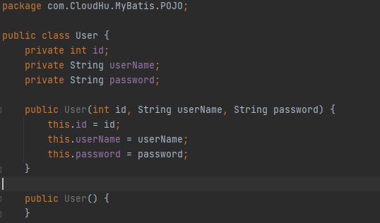
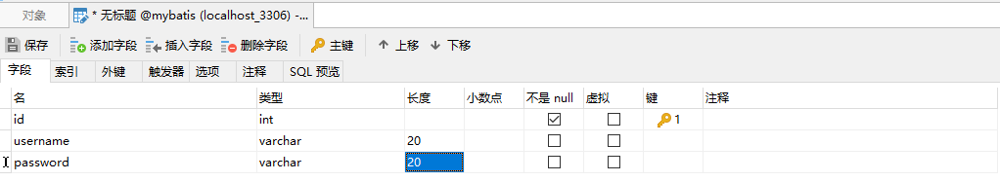
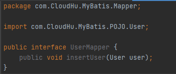
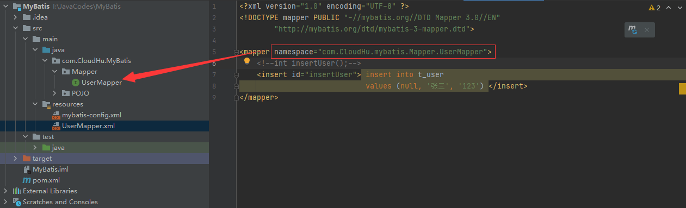
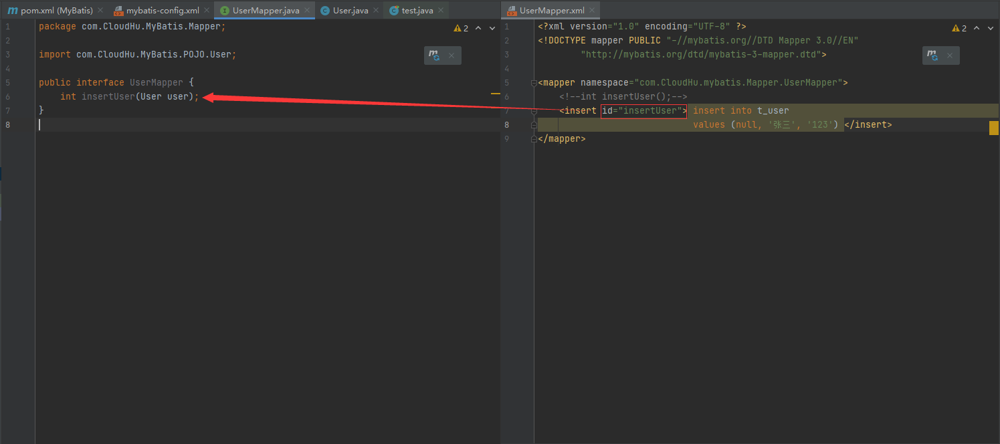
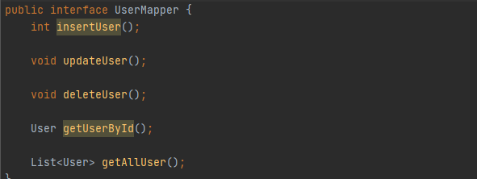
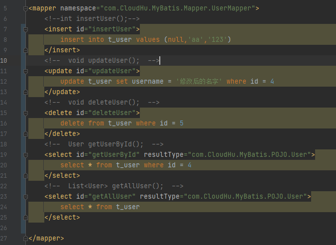

# Mybatis学习笔记（保持更新）

## 声明

本笔记源于尚硅谷的教程再加上自己的总结，如果有不明白的地方需要参考原教程[MyBatis教程](https://www.bilibili.com/video/BV1VP4y1c7j7?p=25&spm_id_from=pageDriver)

### 特性

1.是一个半自动的ORM框架

2.支持定制化SQL、存储过程以及高级映射

### 和其他技术的对比

#### JDBC
1. SQL语句夹杂，当需求更改时，代码更改困难
2. 代码冗长，开发效率低

####Hibernate和JPA
1. 操作简便，开发效率高
2. 程序中的长难SQL需要绕过框架
3. 内部自动产生的SQL，不容易做特殊优化
4. 基于全映射，大量字段的POJO进行部分映射比较困难

####MyBatis
1. 轻量级，性能好
2. SQL 和 Java语句分开
3. 效率略低于Hibernate，但能够接受

### Maven配置
将以下代码加入pom.xml文件中
```
<dependencies>
        <!-- mybatis -->
        <dependency>
            <groupId>org.mybatis</groupId>
            <artifactId>mybatis</artifactId>
            <version>3.5.7</version>
        </dependency>
        <!-- junit -->
        <dependency>
            <groupId>junit</groupId>
            <artifactId>junit</artifactId>
            <version>4.13.2</version>
            <scope>test</scope>
        </dependency>
        <!-- mysql连接 -->
        <dependency>
            <groupId>mysql</groupId>
            <artifactId>mysql-connector-java</artifactId>
            <version>8.0.20</version>
        </dependency>
        <dependency>
            <groupId>junit</groupId>
            <artifactId>junit</artifactId>
            <version>4.12</version>
            <scope>test</scope>
        </dependency>
    </dependencies>
```

### 配置映射文件

在src/main/resources的路径下创建名为mybatis-config.xml的配置文件，并添加以下代码

<span id="jump3">**注意：
核心配置文件中的标签必须按照固定的顺序：
properties?,settings?,typeAliases?,typeHandlers?,objectFactory?,objectWrapperFactory?,reflectorF
actory?,plugins?,environments?,databaseIdProvider?,mappers?**</sapn>

```
<?xml version="1.0" encoding="UTF-8" ?> <!DOCTYPE configuration PUBLIC "-//mybatis.org//DTD Config 3.0//EN"
        "http://mybatis.org/dtd/mybatis-3-config.dtd">
<configuration>
    <!--设置连接数据库的环境-->
    <environments default="development">
        <environment id="development">
            <!--事务管理类型-->
            <transactionManager type="JDBC"/>
            <!--使用连接池-->
            <dataSource type="POOLED">
                <property name="driver" value="com.mysql.cj.jdbc.Driver"/>
                <!--这里会出毛病-->
                <!--<property name="url" value="jdbc:mysql://localhost:3306/MyBatis"/>-->
                <property name="url" value="jdbc:mysql://localhost:3306/mybatis?useUnicode=true&amp;useJDBCCompliantTimezoneShift=true&amp;useLegacyDatetimeCode=false&amp;serverTimezone=UTC"/>
                <property name="username" value="root"/>
                <property name="password" value="123456"/>
            </dataSource>
        </environment>
    </environments>
    <!--引入映射文件-->
    <mappers>
        <mapper resource="mappers/UserMapper.xml"/>
    </mappers>
</configuration>
```
注意，deriver的值在高版本的connecter下为com.mysql.cj.jdbc.Driver而非com.mysql.jdbc.Driver

### mapper接口
MyBatis中的mapper接口相当于以前的dao。但是区别在于，mapper仅仅是接口，我们不需要
提供实现类。

创建数据表



创建实体类



创建mapper接口



### 创建映射文件
要点1：映射文件中mapper的命名空间与全类名一致

要点2：映射文件中SQL语句的id和mapper接口的方法名一致



### 测试功能

新建测试方法
代码如下
```
@Test
    public void test(){
        try {
            //加载核心配置文件
            InputStream is = Resources.getResourceAsStream("mybatis-config.xml");
            //获取sqlSessionFactoryBuilder
            SqlSessionFactoryBuilder sqlSessionFactoryBuilder = new SqlSessionFactoryBuilder();
            //使用配置文件创建的流来获取sqlSessionFactory
            SqlSessionFactory sqlSessionFactory = sqlSessionFactoryBuilder.build(is);
            //获取sqlSession(自动提交事务)
            //如果不写true是手动提交事务
            SqlSession sqlSession=sqlSessionFactory.openSession(true);
            //获取Mapper接口的实现类
            UserMapper userMapper = sqlSession.getMapper(UserMapper.class);
            //测试功能
            userMapper.insertUser();
        } catch (IOException e) {
            e.printStackTrace();
        }
    }
```

我途中遇到的问题：

1. mybatis的配置文件中，写成这样会有时区的问题（8.0版本以上的connector会有这个问题）

``<property name="url" value="jdbc:mysql://localhost:3306/MyBatis"/>``

改成这个就行

```<property name="url" value="jdbc:mysql://localhost:3306/mybatis?useUnicode=true&amp;useJDBCCompliantTimezoneShift=true&amp;useLegacyDatetimeCode=false&amp;serverTimezone=UTC"/>```

2. mybatis的配置文件记得更新映射文件

**重点**

获取Mapper接口的实现类，将Mapper接口转为实现类的工作是在sqlSession的getMapper方法中去做的，原理是使用代理模式


### 增删改查

先编写接口中的方法



再在映射文件中进行配置



需要提到的是，查询的配置语句需要加resultType或者resultMap来指定查询结果对应的哪个类
resultType是默认的映射关系（用于属性名和字段名一致的情况）
resultMap是自定义的映射关系（用于一对多或者多对一或字段名与属性名不一致的情况）

### 加入log4j日志功能

**注意**

log4j被曝有重大bug，在学习过程中可以暂时不用管版本问题，但在实际应用中应使用2.14.1及以上版本
具体bug在此处不详述，具体参考[log4j漏洞的产生原因和解决方案，小白都能看懂！！！！](https://zhuanlan.zhihu.com/p/444814529)

添加依赖
```
<dependency>
    <groupId>log4j</groupId>
    <artifactId>log4j</artifactId>
    <version>1.2.17</version>
</dependency>
```

配置映射文件
```
<?xml version="1.0" encoding="UTF-8" ?> <!DOCTYPE log4j:configuration SYSTEM "log4j.dtd">
<log4j:configuration xmlns:log4j="http://jakarta.apache.org/log4j/">
    <appender name="STDOUT" class="org.apache.log4j.ConsoleAppender">
        <param name="Encoding" value="UTF-8"/>
        <layout class="org.apache.log4j.PatternLayout">
            <param name="ConversionPattern" value="%-5p %d{MM-dd HH:mm:ss,SSS} %m (%F:%L) \n"/>
        </layout>
    </appender>
    <logger name="java.sql">
        <level value="debug"/>
    </logger>
    <logger name="org.apache.ibatis">
        <level value="info"/>
    </logger>
    <root>
        <level value="debug"/>
        <appender-ref ref="STDOUT"/>
    </root>
</log4j:configuration>
```


日志的级别
FATAL(致命)>ERROR(错误)>WARN(警告)>INFO(信息)>DEBUG(调试)
从左到右打印的内容越来越详细


### 一些修改和优化
#### 1.将mybatis-config的部分参数放到properties文件中

jdbc.properties内容如下
```
jdbc.driver=com.mysql.cj.jdbc.Driver
jdbc.url=jdbc:mysql://localhost:3306/mybatis?useUnicode=true&useJDBCCompliantTimezoneShift=true&useLegacyDatetimeCode=false&serverTimezone=UTC
jdbc.username=root
jdbc.password=123456
```

mybatis-config.xml中的dataSource部分修改为以下内容
```
<dataSource type="POOLED">
    <property name="driver" value="${jdbc.driver}"/>
    <property name="url" value="${jdbc.url}"/>
    <property name="username" value="${jdbc.username}"/>
    <property name="password" value="${jdbc.password}"/>
</dataSource>
```

#### <span id = "jump2">2.将mapper的映射文件改为接受传参的方式</sapn>

##### 只有一个参数的情况

有两种方式，以getUserById方法为例进行演示

第一种是#{}，原理是占位符
```
<!--  User getUserById(int id);  -->
<select id="getUserById" resultType="com.CloudHu.MyBatis.POJO.User">
    select * from t_user where id = #{id}
</select>
```
第二种是${}，原理是字符串拼接
```
<!--  User getUserById(int id);  -->
<select id="getUserById" resultType="com.CloudHu.MyBatis.POJO.User">
    select * from t_user where id = ${id}
</select>
```

##### 有多个参数的情况

默认只能使用arg0,arg1...来表示参数或者param1,param2...（注意一个是0基，一个是1基）
原理是mybatis将参数放进了map中，以两种方式进行储存
a>以arg0，arg1为键，以参数为值
b>以param1,param2为键，以参数为值
```
<!--  User checkLogin(String userName,String password);  -->
<select id="checkLogin" resultType="com.CloudHu.MyBatis.POJO.User">
    select * from t_user where username = #{arg0} and password = #{arg1}
</select>
```

若不想使用arg0这种形式，则可以把参数先放进一个map中，将map作为参数传进来就即可。
或者[使用@Param()注解为参数命名](#jump1)


##### 使用pojo作为参数的情况

同上即可，但需要注意，属性名有大小写的分别，#{userName}属性不能写成#{username}

```
<!--int insertUser(User user);-->
<insert id="insertUser">
    insert into t_user values (null,#{userName},#{password})
</insert>
```

##### @Param()注解的使用

<span id="jump1">在mapper接口处使用该注解</span>

``User checkLoginByParam(@Param("username") String userName, @Param("password")String password);``


#### 一些特殊sql语句

##### 1.模糊查询

有两种方式

第一种，使用#{}

**注意：需要用双引号来括住百分号，不能使用单引号**

```
<select id="getUserByLike" resultType="com.CloudHu.MyBatis.POJO.User">
    select * from t_user where username like "%"#{username}"%"
</select>
```

第二种，使用${}

```
<select id="getUserByLike" resultType="com.CloudHu.MyBatis.POJO.User">
    select * from t_user where username like '%${username}%'
</select>
```

##### 2.批量删除

sql在批量删除时需要用到引号，例如语句

`delete from t_user where id in ('1,2,3')`

在mapper的映射文件中，因为两种传参的原理不同，这就导致在配置批量删除的方法时，只能使用${}的方式,[原理差别](#jump2)在上文处提过

${}方式

```
<!--int deleteMore(@Param("ids") String ids);-->
<delete id="deleteMore">
    delete from t_user where id in (${ids})
</delete>
```

##### 3.动态表名

之前使用的都是固定的表名，若要将表名当做参数，只能使用${}方式，原因和上方提到一样

${}方式
```
<!--  User getUserByDynamicTableName(@Param("tablename")String tablename,@Param("id")int id);  -->
<select id="getUserByDynamicTableName" resultType="com.CloudHu.MyBatis.POJO.User">
    select * from ${tablename} where id = ${id}
</select>
```

### 解决属性名和字段名不一致的问题

有时会出现数据库中的字段名与后端中实体的属性名不一致的情况，此时需要在mapper的配置文件中做出修改，具体方法有三种。

假设现在有一个员工(Emp)数据表，sql结构为eid,e_name

员工实体类的属性为id,name

（这里偷了个懒，没在演示代码里面添加这些内容）

（但是底下给的代码应该没问题）

（大概）

#### 1.为字段起别名

通过起别名的方式来使字段名与属性名相对应，别名即为属性名。

```
<!--  Emp getEmpById(int id);  -->
<select id="getEmpById" resultType="com.CloudHu.MyBatis.POJO.Emp">
    select eid id,e_name name from t_emp where eid = ${id}
</select>
```

#### 2.设置驼峰命名法

mybatis支持将下划线转为驼峰命名法，例如将Emp_name转为EmpName。使用这个方法的前提是转化后的sql的字段名与属性名可以对应，在我举的例子里这个方法是行不通的，得把属性名改成eName才行。


下面是具体操作方法，在mybatis的核心配置文件中添加以下代码,注意[核心配置文件的语序](#jump3)。


```
<settings>
    <setting name="mapUnderscoreToCamelCase" value="true" /><setting>
</settings>
```

#### 3.使用resultMap手动指定映射关系


在mapper的映射文件中添加以下代码

```
<!--注意这里的id与下面的resultMap相对应-->
<resultMap id="empResultMap" type="Emp">

    <!--主键-->
    <!--property对应着sql的字段名，column对应着后端实体的属性名-->
    <id property="eid" column="id"></id>
    
    <!--其他属性-->
    <!--property对应着sql的字段名，column对应着后端实体的属性名-->
    <result property="e_name" column="name"></result>
    
</resultMap>


<!--  Emp getAllEmp();  -->
<select id="getAllEmp" resultMap="empResultMap">
    select * from t_emp
</select>

```